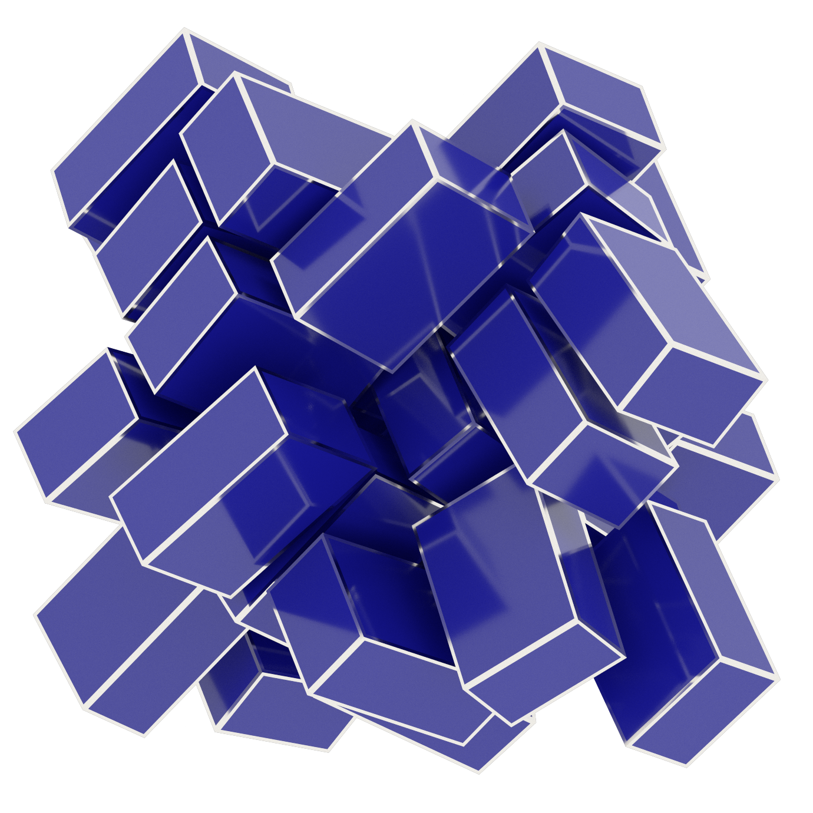

.. Copyright (c) 2016-2023 The Regents of the University of Michigan
.. Part of fresnel, released under the BSD 3-Clause License.

Cuboids
-------

Cuboid example script:

* Geometry: :py:class:`geometry.ConvexPolyhedron <fresnel.geometry.ConvexPolyhedron>`: *outline_width* = 0.015

    * :py:class:`material <fresnel.material.Material>`: *roughness* = 0.1, *specular* = 1, *metal* = 0, *spec_trans* = 0
    * :py:class:`outline_material <fresnel.material.Material>`: *roughness* = 0.1, *metal* = 1, *spec_trans* = 0, *color* = (0.95,0.93,0.88)
    * position, orientation: output of a `HOOMD <http://glotzerlab.engin.umich.edu/hoomd-blue/>`_ simulation

* Lighting: :py:meth:`light.lightbox <fresnel.light.lightbox>`
* Rendered with: :py:class:`tracer.Path <fresnel.tracer.Path>`: *samples* = 256, *light_samples* = 16

.. rubric:: Source code

.. literalinclude:: cuboid.py

.. rubric:: Author

*Joshua A. Anderson*
