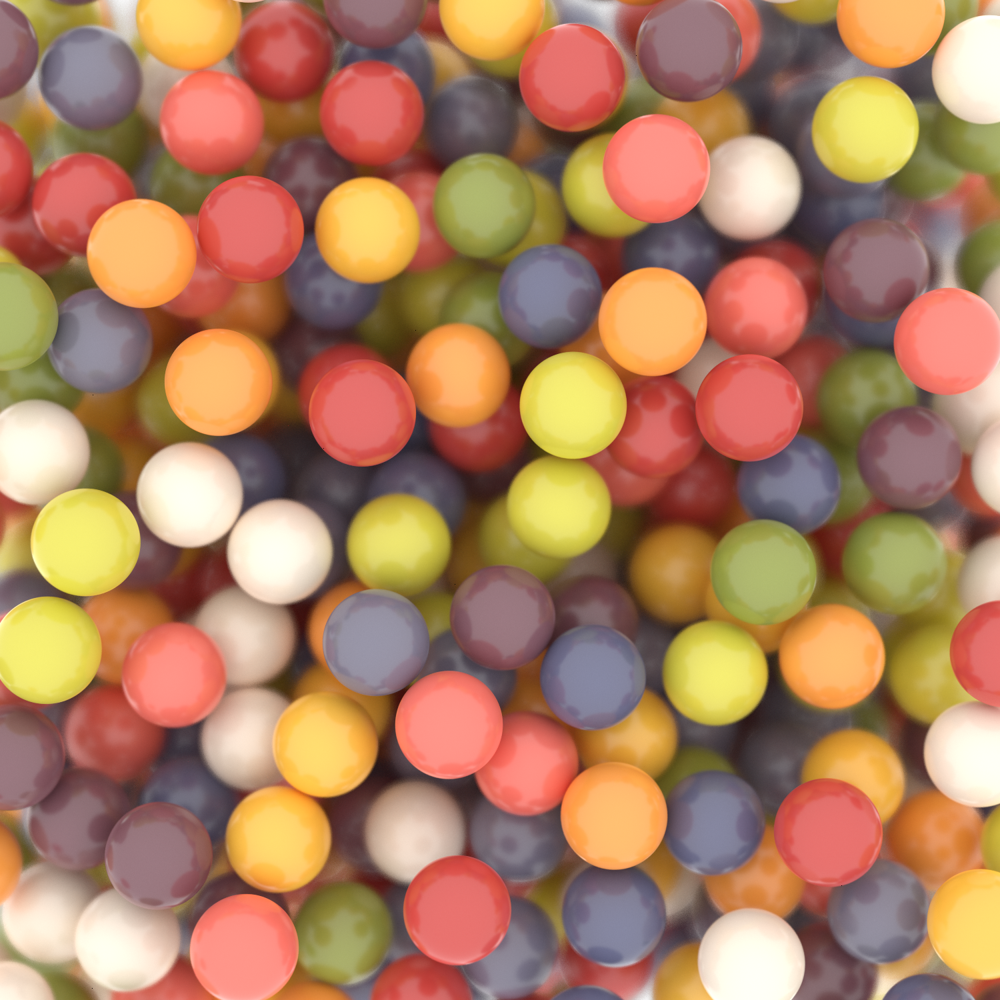

.. Copyright (c) 2016-2021 The Regents of the University of Michigan
.. Part of fresnel, released under the BSD 3-Clause License.

Gumballs
--------

Spheres rendered as gumballs made from a Monte Carlo simulation with `HOOMD <https://glotzerlab.engin.umich.edu/hoomd-blue/>`__.

* Geometry: :py:class:`geometry.Sphere <fresnel.geometry.Sphere>`: *radius* = 0.5

    * :py:class:`material <fresnel.material.Material>`: *primitive_color_mix* = 1.0, *roughness* = 0.2, *specular* = 0.8
    * positions: output of a `HOOMD <http://glotzerlab.engin.umich.edu/hoomd-blue/>`__ simulation
    * colors: randomly assigned from a set of gumball colors

* Lighting: :py:meth:`light.lightbox <fresnel.light.lightbox>` with an additional light
* Rendered with: :py:class:`tracer.Path <fresnel.tracer.Path>`: *samples* = 256, *light_samples* = 64 on the GPU

.. rubric:: Source code

.. literalinclude:: gumballs.py

.. rubric:: Author

*Bradley Dice*
