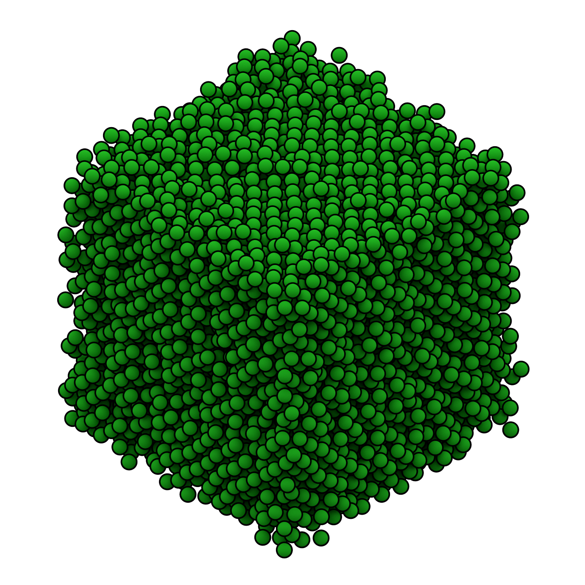

.. Copyright (c) 2016-2021 The Regents of the University of Michigan
.. Part of fresnel, released under the BSD 3-Clause License.

Spheres
-------

Spheres example script:

* Geometry: :py:class:`geometry.Sphere <fresnel.geometry.Sphere>`: *radius* = 0.5, *outline_width* = 0.1

    * :py:class:`material <fresnel.material.Material>`: *roughness* = 0.8, *specular* = 0.2, *metal* = 0, *spec_trans* = 0
    * :py:class:`outline_material <fresnel.material.Material>`: *solid* = 1, *color* = (0,0,0)
    * positions: output of a `HOOMD <http://glotzerlab.engin.umich.edu/hoomd-blue/>`_ simulation

* Lighting: :py:meth:`light.cloudy <fresnel.light.cloudy>`
* Rendered with: :py:class:`tracer.Path <fresnel.tracer.Path>`: *samples* = 256, *light_samples* = 16

.. rubric:: Source code

.. literalinclude:: sphere.py

.. rubric:: Author

*Joshua A. Anderson*
