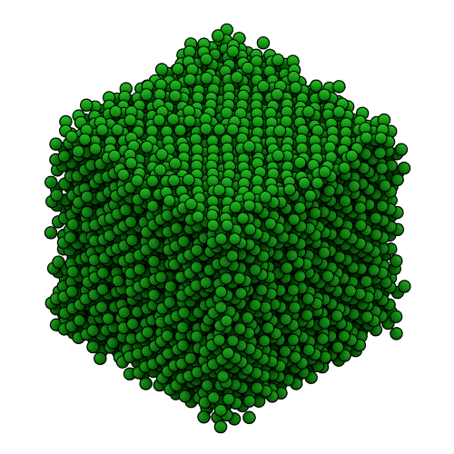
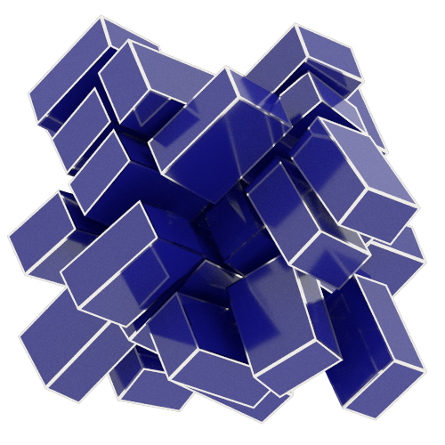

Fresnel
++++++++++

**fresnel** is a python library for path tracing publication quality images of soft matter simulations in real time.
The fastest render performance is possible on NVIDIA GPUs using their `OptiX <https://developer.nvidia.com/optix>`_
ray tracing engine. **fresnel** also supports multi-core CPUs using Intel's `Embree <https://embree.github.io/>`_
ray tracing kernels. Path tracing enables high quality global illumination and advanced rendering effects controlled by
intuitive parameters (like *roughness*, *specular*, and *metal*).

Samples
_______

Here are a few quick samples of what **fresnel** can do:

.. literalinclude:: sphere.py
    :lines: 1-19

.. literalinclude:: cuboid.py
    :lines: 1-29

.. toctree::
    :maxdepth: 1
    :caption: Getting started

    installation
    changes
    community

.. toctree::
    :maxdepth: 1
    :caption: Basic tutorials
    :glob:

    examples/0*

.. toctree::
    :maxdepth: 1
    :caption: Primitives
    :glob:

    examples/1*

.. toctree::
    :maxdepth: 1
    :caption: Advanced topics
    :glob:

    examples/2*

.. toctree::
    :maxdepth: 3
    :caption: Python API Reference

    package-fresnel

.. toctree::
    :maxdepth: 1
    :caption: Additional information

    license
    credits
    indices
